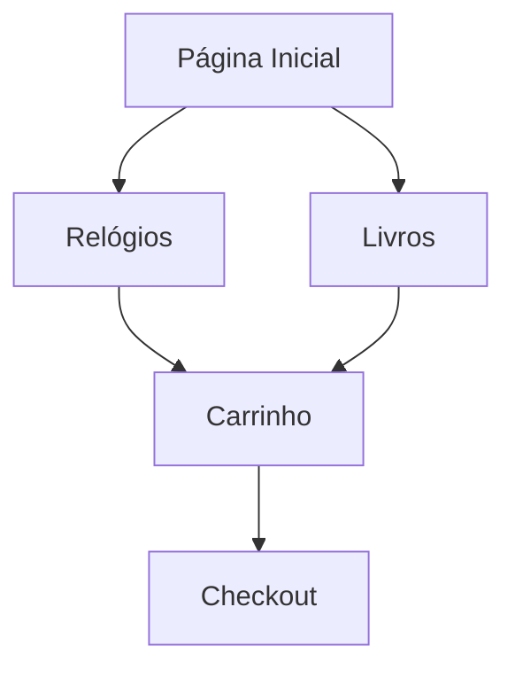

Para adicionar uma imagem ao README.md, você tem várias opções. Aqui estão as principais formas:

## 📸 Métodos para Adicionar Imagens

### 1. **Imagem Local (no repositório)**
```markdown

```

### 2. **Imagem da Web (URL)**
```markdown

```

### 3. **Imagem com Link**
```markdown
[](https://link-destino.com)
```

### 4. **Imagem com Tamanho Customizado**
```markdown

```

## 🎨 Exemplos Práticos para Seu Projeto

### Logo do Projeto
```markdown
<div align="center">

# 📚 Chrono & Code


*Plataforma de E-commerce Elegante*

</div>
```

### Banner Principal
```markdown

```

### Screenshots das Páginas
```markdown
## 📱 Screenshots

### Página Inicial


### Catálogo de Relógios  


### Catálogo de Livros

```

### Badges Personalizadas
```markdown


```

## 🗂️ Estrutura Recomendada de Pastas

Crie esta estrutura no seu repositório:
```
projeto/
├── assets/
│   ├── logo.png
│   ├── banner.jpg
│   └── icons/
├── screenshots/
│   ├── homepage.png
│   ├── watches.png
│   └── books.png
├── docs/
│   └── images/
└── README.md
```

## 🖼️ Exemplo Completo com Imagens

Aqui está como ficaria seu README com imagens:

```markdown
<div align="center">

# 🕰️ Chrono & Code


**E-commerce Sofisticado para Relógios de Luxo e Livros**

[](https://github.com/HackMaster300/chrono-code/stargazers)
[](https://github.com/HackMaster300/chrono-code/network/members)

</div>

## 🎯 Visão Geral


O **Chrono & Code** é uma plataforma de e-commerce que une a precisão dos relógios de luxo com a magia dos livros em uma experiência única de compra.

## ✨ Funcionalidades

### 🛒 Sistema de Carrinho


- Carrinho persistente com localStorage
- Gestão de quantidades em tempo real
- Cálculos automáticos de total

### 📱 Design Responsivo


- Layout adaptável para todos os dispositivos
- Navegação intuitiva e fluida
- Experiência mobile-first

## 🏗️ Arquitetura



## 🚀 Como Usar

1. **Clone o repositório**
   ```bash
   git clone https://github.com/HackMaster300/chrono-code.git
   ```

2. **Abra no navegador**
   ```bash
   cd chrono-code
   # Abra index.html no navegador
   ```

## 📸 Galeria

<div align="center">

| Página de Relógios | Página de Livros |
|:------------------:|:----------------:|
|  |  |

</div>

## 🛠️ Tecnologias

<div align="center">


</div>

---

<div align="center">

### ⭐ Deixe uma estrela se gostou do projeto!

**Desenvolvido com ❤️ por [Zerdone Rocha](https://github.com/HackMaster300)**


</div>
```

